# 基本設計書

## 1. システム概要

### 1.1 システム名

**タスク管理システム**

### 1.2 システムの目的

本システムは、複数のプロジェクトとタスクを一元管理し、タスクの進捗状況を可視化することで、チームメンバー間の円滑なコミュニケーションを支援することを目的としています。各ユーザーの役割に応じた権限を付与し、プロジェクトおよびタスクの作成や管理が可能です。また、法人向けプロジェクト管理システムとして、クライアントの管理機能および拡張性を考慮した設計がされています。

### 1.3 システムの背景

従来のタスク管理方法では、プロジェクトごとのタスク進捗が不透明で、担当者の負荷が見えづらい状況が課題となっていました。また、クライアントと一般ユーザー間のコミュニケーション不足により、タスクのステータス更新が遅れることがありました。本システムは、これらの課題を解決し、タスクの進捗状況を効率的に管理し、円滑なコミュニケーションを実現します。

### 1.4 主要機能

- **タスク管理機能**: プロジェクトごとにタスクを作成し、進捗状況（pending、in_progress、completed）を管理。
- **ユーザー管理機能**: 管理者、クライアント、一般ユーザーの役割に応じたアクセス権限の設定。
- **プロジェクト管理機能**: プロジェクトの作成、編集、割り当て。
- **コメント機能**: タスクに対するコメントを通じたコミュニケーション支援。
- **ダッシュボード**: プロジェクトおよびタスクの進捗状況を可視化。

### 1.5 システムの範囲

- 利用者: 管理者、クライアント、一般ユーザー。
- システムの対応範囲: プロジェクトの作成、タスクの管理、進捗状況の確認、コメント機能によるコミュニケーション。
- 対応デバイス: PC、スマートフォン、タブレットなどのデバイスからアクセス可能。
- 導入環境: クラウドベースまたはオンプレミスのサーバー環境。

### 1.6 制約事項

- システムの稼働時間は24時間365日を目標とする。ただし、メンテナンス時間は別途設定する。
- システムの応答時間は1秒以内を目標とする（応答性能は今後の最適化により調整）。
- 同時接続ユーザー数は500人を想定している（規模拡大に応じて調整可能）。
- データベースは暗号化されて保存され、通信はSSL/TLSを使用してセキュリティを強化する。

## 2. システム構成

### 2.1 全体アーキテクチャ（詳細化）

- **フロントエンド**: Reactで構築され、APIサーバーに対してHTTPリクエストを送信し、JSON形式のデータを受信して表示。
- **バックエンド**: Laravelを使用して構築されたAPIサーバー。ユーザー認証、データ管理、プロジェクト・タスクのロジックを処理。
- **データベース**: MySQLを使用し、永続化されたデータを管理。ユーザー、タスク、プロジェクトの情報を保存。
- **phpMyAdmin**: データベースの管理インターフェース。MySQLデータベースの操作や管理を行うためのツール。
- **Docker**: 各コンポーネントをコンテナ化し、開発・本番環境の整合性を保つための仕組みを提供。

### 2.2 システム構成図

### システム構成図（Mermaid形式）
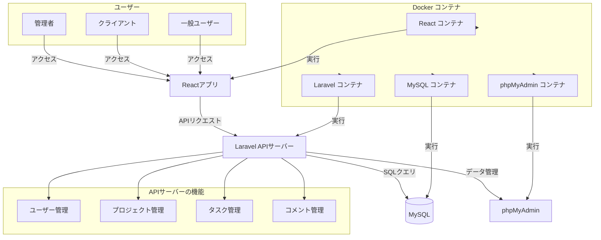

### システム構成図の詳細解説

#### 1. ユーザーの役割
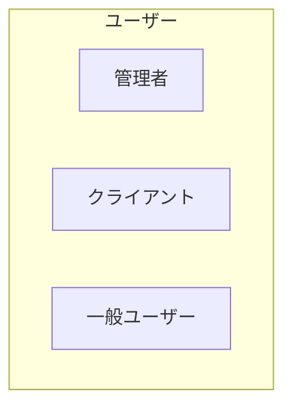
- **管理者**: システム全体の管理を担当し、ユーザー管理、プロジェクト作成、タスク管理などの高度な操作が可能です。
- **クライアント**: 特定のプロジェクトに対する管理者として、プロジェクト内のタスクやユーザーを管理します。
- **一般ユーザー**: クライアントによって割り当てられたタスクの管理や、タスクに対するコメントの追加が可能です。主に自身の作業に関連する部分にアクセスします。

#### 2. フロントエンド
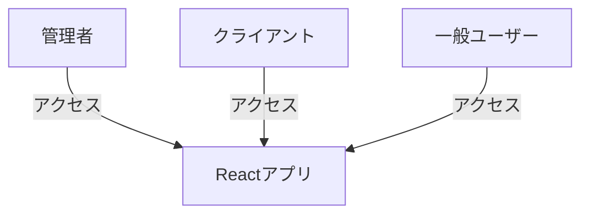
- **Reactアプリ**: フロントエンドはReactを使用して構築されたシングルページアプリケーション（SPA）で、ユーザーインターフェース（UI）を提供します。ブラウザ上で動作し、バックエンドとの通信はAPIリクエストを介して行います。
- 各ユーザー（管理者、クライアント、一般ユーザー）はこのReactアプリケーションを通じてシステムにアクセスし、自分の権限に応じた操作を行います。

#### 3. フロントエンドとバックエンドの通信
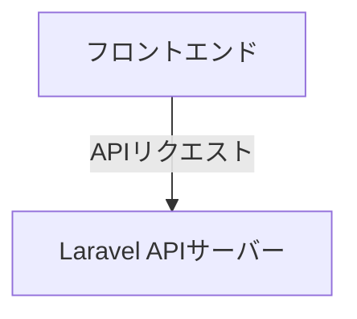
- **APIリクエスト**: フロントエンドはバックエンドに対してHTTP/HTTPSを介してAPIリクエストを送信します。これにより、ユーザーの操作（タスクの作成、コメントの追加など）がサーバーに反映されます。
- **バックエンド**: Laravelフレームワークを使用して構築されたAPIサーバーがリクエストを受け取り、必要な処理を行います。例えば、タスク管理、ユーザー管理、プロジェクト管理などが含まれます。

#### 4. バックエンドとデータベースの通信
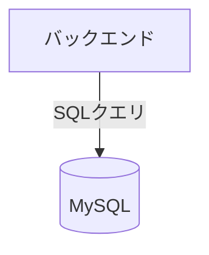
- **データベース（MySQL）**: バックエンドはMySQLデータベースと通信して、ユーザー、タスク、プロジェクトなどのデータを保存および取得します。データベースはリレーショナルデータベースであり、データはテーブル形式で保存されます。
- **SQLクエリ**: LaravelのORMであるEloquentを介して、SQLクエリを発行してデータの永続化や検索を行います。

#### 5. バックエンドとデータ管理の通信（phpMyAdmin）
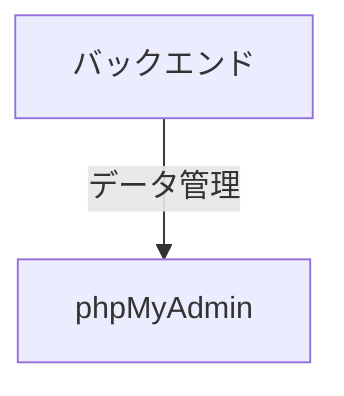
- **phpMyAdmin**: データベース管理ツールであり、MySQLデータベースを管理するために使用されます。システム管理者がデータの直接操作やデータベースのメンテナンスを行うために利用します。例えば、データのバックアップやリストア、データの手動編集が可能です。
- **データ管理**: phpMyAdminはバックエンドの管理機能と連携し、データベースの操作をGUIで簡単に行えるようにします。

#### 6. バックエンドの主要機能
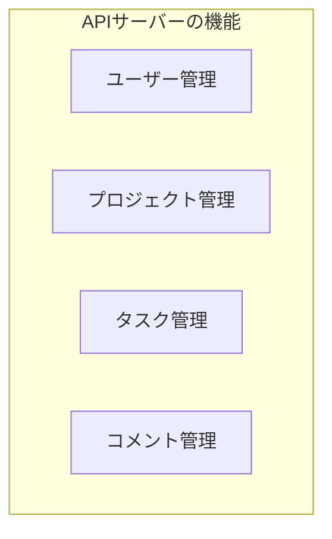
- **ユーザー管理**: 新規ユーザーの作成や、ユーザー情報の編集、削除など、ユーザーに関するすべての管理を行います。ユーザーごとの権限設定（管理者、クライアント、一般ユーザー）もここで行われます。
- **プロジェクト管理**: プロジェクトの作成・編集・削除を行います。また、プロジェクトにユーザーを割り当てたり、プロジェクトの概要を設定する機能も含まれます。
- **タスク管理**: 各プロジェクトに関連するタスクの作成・編集・削除を管理します。タスクには進捗状況（pending、in_progress、completed）があり、担当者を割り当てることができます。
- **コメント管理**: タスクに対するコメントの作成・編集・削除を管理し、プロジェクトメンバー間のコミュニケーションを支援します。

#### 7. Dockerコンテナの役割
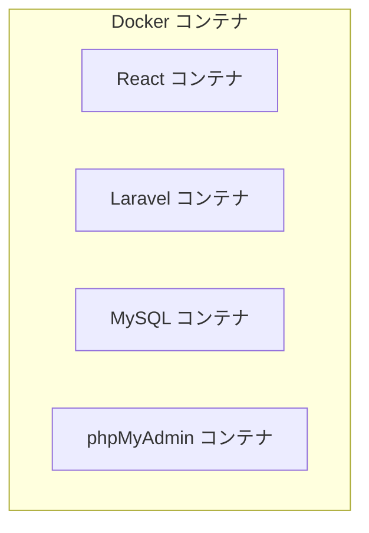
- **Reactコンテナ**: Reactアプリケーションを実行するための環境を提供します。ユーザーインターフェースがこのコンテナで動作します。
- **Laravelコンテナ**: Laravelフレームワークを実行するためのバックエンド環境を提供します。ここでAPIサーバーが稼働し、ユーザーからのリクエストを処理します。
- **MySQLコンテナ**: MySQLデータベースを実行する環境を提供します。データベースに保存されたデータはこのコンテナ内で管理されます。
- **phpMyAdminコンテナ**: phpMyAdminを実行する環境を提供し、データベース管理者がデータを操作・管理するためのGUIを提供します。

#### 8. Dockerによるコンテナ管理
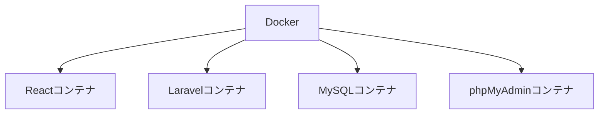
- **Docker**: すべてのコンテナを一元管理し、各コンポーネントが独立した環境で動作できるようにします。これにより、開発環境と本番環境の一貫性が保たれ、デプロイ作業も効率化されます。

### 2.3 使用技術

- **フロントエンド**: React
  - JavaScriptベースのライブラリを使用し、UIコンポーネントの効率的な再利用を実現。
- **バックエンド**: Laravel
  - PHPで構築されたWebアプリケーションフレームワーク。認証やデータベース操作、API構築に利用。
- **データベース**: MySQL
  - リレーショナルデータベース。ユーザー、プロジェクト、タスクの情報を管理。
- **コンテナ**: Docker
  - 各コンポーネントを独立したコンテナで運用し、環境の一貫性を保つ。

### 2.4 デプロイ環境

システムは以下の環境でデプロイされます。

- **クラウドサービス**: AWS（Amazon Web Services）またはGCP（Google Cloud Platform）を想定。
- **オペレーティングシステム**: Linuxベース（Ubuntu）。
- **Webサーバー**: Apache（APIサーバーのホスティング）。
- **ネットワーク**: ロードバランサーやファイアウォールにより、セキュリティとスケーラビリティを確保。

### 2.5 コンポーネント間の通信（詳細化）

- **クライアントとAPIサーバー**: ReactフロントエンドからLaravel APIサーバーに対してHTTP/HTTPSを使用して通信。クライアントが送信するAPIリクエストは、REST形式で行われ、JSON形式のレスポンスが返されます。
- **APIサーバーとデータベース**: LaravelのORM（Eloquent ORM）を使用してMySQLとデータのやり取りを行います。データの永続化や検索、更新が行われます。
- **APIサーバーとphpMyAdmin**: LaravelのAPIサーバーとphpMyAdminは、MySQLデータベースを介してデータ管理機能を共有。phpMyAdminはデータベース管理のために使用され、GUIでデータベースの操作が可能。

## 3. データベース設計

### 3.1 テーブル構成

#### 3.1.1 `user_accounts` テーブル

| カラム名       | データ型                       | 制約                            | 説明                         |
|----------------|--------------------------------|---------------------------------|------------------------------|
| id             | BIGINT                         | PRIMARY KEY, AUTO_INCREMENT     | ユーザーの一意の識別子       |
| user_id        | VARCHAR(255)                   | NOT NULL, UNIQUE                | ユーザー識別子（ユニーク）   |
| name           | VARCHAR(255)                   | NOT NULL                        | ユーザーの名前               |
| furigana       | VARCHAR(255)                   | NULL                            | ユーザーのふりがな（オプション）|
| email          | VARCHAR(255)                   | NOT NULL, UNIQUE                | ユニークなメールアドレス     |
| password       | VARCHAR(255)                   | NOT NULL                        | ハッシュ化されたパスワード    |
| role           | ENUM('admin', 'client', 'user')| NOT NULL                        | ユーザーの役割（管理者、クライアント、一般ユーザー） |
| active_flag    | TINYINT(1)                     | NOT NULL, DEFAULT '1'           | ユーザーのアクティブ状態（1: 有効, 0: 無効）|
| deleted_flag   | TINYINT(1)                     | NOT NULL, DEFAULT '0'           | ユーザーの削除状態（1: 削除済み, 0: 未削除）|
| created_at     | TIMESTAMP                      | NULL                            | 作成日時                     |
| updated_at     | TIMESTAMP                      | NULL                            | 更新日時                     |
| deleted_at     | TIMESTAMP                      | NULL                            | 削除日時（オプション）       |

#### 3.1.2 `projects` テーブル

| カラム名       | データ型                       | 制約                            | 説明                         |
|----------------|--------------------------------|---------------------------------|------------------------------|
| id             | BIGINT                         | PRIMARY KEY, AUTO_INCREMENT     | プロジェクトの一意の識別子   |
| name           | VARCHAR(255)                   | NOT NULL                        | プロジェクト名               |
| description    | TEXT                           | NULL                            | プロジェクトの詳細説明       |
| owner_id       | BIGINT                         | FOREIGN KEY, NOT NULL           | `user_accounts` テーブルのID |
| created_at     | TIMESTAMP                      | NULL                            | 作成日時                     |
| updated_at     | TIMESTAMP                      | NULL                            | 更新日時                     |

#### 3.1.3 `tasks` テーブル

| カラム名       | データ型                       | 制約                            | 説明                         |
|----------------|--------------------------------|---------------------------------|------------------------------|
| id             | BIGINT                         | PRIMARY KEY, AUTO_INCREMENT     | タスクの一意の識別子         |
| title          | VARCHAR(255)                   | NOT NULL                        | タスクのタイトル             |
| description    | TEXT                           | NULL                            | タスクの詳細説明             |
| status         | ENUM('pending', 'in_progress', 'completed') | NOT NULL DEFAULT 'pending' | タスクの進捗状況             |
| assigned_to    | BIGINT                         | FOREIGN KEY, NOT NULL           | `user_accounts` テーブルのID |
| project_id     | BIGINT                         | FOREIGN KEY, NOT NULL           | `projects` テーブルのID      |
| due_date       | DATETIME                       | NOT NULL                        | タスクの締切日               |
| created_at     | TIMESTAMP                      | NULL                            | 作成日時                     |
| updated_at     | TIMESTAMP                      | NULL                            | 更新日時                     |

#### 3.1.4 `comments` テーブル

| カラム名       | データ型                       | 制約                            | 説明                         |
|----------------|--------------------------------|---------------------------------|------------------------------|
| id             | BIGINT                         | PRIMARY KEY, AUTO_INCREMENT     | コメントの一意の識別子       |
| task_id        | BIGINT                         | FOREIGN KEY, NOT NULL           | `tasks` テーブルのID         |
| user_id        | BIGINT                         | FOREIGN KEY, NOT NULL           | `user_accounts` テーブルのID |
| comment        | TEXT                           | NOT NULL                        | コメント内容                 |
| created_at     | TIMESTAMP                      | NULL                            | 作成日時                     |
| updated_at     | TIMESTAMP                      | NULL                            | 更新日時                     |

#### 3.1.5 `project_user` テーブル

| カラム名       | データ型                       | 制約                            | 説明                         |
|----------------|--------------------------------|---------------------------------|------------------------------|
| id             | BIGINT                         | PRIMARY KEY, AUTO_INCREMENT     | プロジェクトユーザーの一意の識別子 |
| project_id     | BIGINT                         | FOREIGN KEY, NOT NULL           | `projects` テーブルのID      |
| user_id        | BIGINT                         | FOREIGN KEY, NOT NULL           | `user_accounts` テーブルのID |
| user_account_id| BIGINT                         | DEFAULT NULL                     | ユーザーアカウントのID       |
| created_at     | TIMESTAMP                      | NULL                            | 作成日時                     |
| updated_at     | TIMESTAMP                      | NULL                            | 更新日時                     |

### 3.2 テーブル間のリレーション

- `users` テーブルと `projects` テーブルは一対多の関係です。（1人のユーザーが複数のプロジェクトを所有できる）
- `projects` テーブルと `tasks` テーブルは一対多の関係です。（1つのプロジェクトに複数のタスクが属する）
- `tasks` テーブルと `comments` テーブルは一対多の関係です。（1つのタスクに複数のコメントが属する）
- `users` テーブルと `comments` テーブルは一対多の関係です。（1人のユーザーが複数のコメントを投稿できる）
- `projects` テーブルと `project_user` テーブルは一対多の関係です。（1つのプロジェクトに複数のユーザーが参加できる）
- `user_accounts` テーブルと `project_user` テーブルは一対多の関係です。（1人のユーザーが複数のプロジェクトに参加できる）

### 3.3 ER図

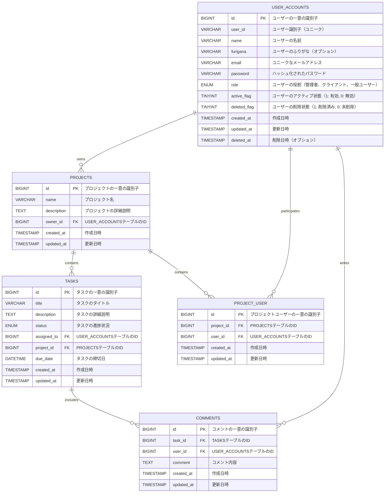

## 4. 詳細設計

### 4.1 API設計

タスク管理システムのAPIエンドポイントは、ユーザーがシステム内で操作できる各種リソースを提供します。

#### 4.1.1 ユーザー関連エンドポイント

- **GET /api/user_accounts**: すべてのユーザーの一覧を取得します。
- **GET /api/user_accounts/{id}**: 指定されたユーザーの詳細を取得します。
- **POST /api/user_accounts**: 新規ユーザーを作成します。
- **PUT /api/user/{id}**: 指定されたユーザー情報を更新します。
- **DELETE /api/user_accounts/{id}**: 指定されたユーザーを削除します。
- **GET /api/user**: 認証されたユーザーの情報を取得します（認証必須）。
- **POST /api/login**: ユーザーがログインします。
- **POST /api/logout**: ユーザーがログアウトします。

#### 4.1.2 プロジェクト関連エンドポイント

- **GET /api/projects**: すべてのプロジェクトの一覧を取得します。
- **GET /api/projects/{id}**: 指定されたプロジェクトの詳細を取得します。
- **POST /api/projects**: 新規プロジェクトを作成します。
- **PUT /api/projects/{id}**: 指定されたプロジェクト情報を更新します。
- **DELETE /api/projects/{id}**: 指定されたプロジェクトを削除します。
- **GET /api/projects/{projectId}/users**: 指定されたプロジェクトに参加しているユーザーの一覧を取得します。
- **POST /api/projects/{projectId}/add-user**: プロジェクトにユーザーを追加します。

#### 4.1.3 タスク関連エンドポイント

- **GET /api/tasks**: すべてのタスクの一覧を取得します。
- **GET /api/tasks/{id}**: 指定されたタスクの詳細を取得します。
- **POST /api/tasks**: 新規タスクを作成します。
- **PUT /api/tasks/{id}**: 指定されたタスク情報を更新します。
- **DELETE /api/tasks/{id}**: 指定されたタスクを削除します。
- **GET /api/projects/{projectId}/tasks**: 指定されたプロジェクトに関連するタスクを取得します。
- **PUT /api/user/tasks/{id}/status**: タスクのステータスを更新します。

#### 4.1.4 コメント関連エンドポイント

- **GET /api/tasks/{task_id}/comments**: 指定されたタスクに対するコメントの一覧を取得します。
- **POST /api/tasks/{task_id}/comments**: 指定されたタスクにコメントを追加します。
- **PUT /api/comments/{id}**: 指定されたコメント情報を更新します。
- **DELETE /api/comments/{id}**: 指定されたコメントを削除します。

## 5. 非機能要件

### 5.1 パフォーマンス

- **応答時間**: 各APIリクエストは1秒以内に応答することを目標とします。
- **スケーラビリティ**: システムは500ユーザーまで同時接続をサポートするように設計されています。

### 5.2 セキュリティ

- **認証**: JWT（JSON Web Token）を使用してユーザーの認証を行います。
- **暗号化**: データベースに保存される機密データ（パスワードなど）はハッシュ化されます。

### 5.3 ロギングとモニタリング

- **ログ管理**: すべてのAPIリクエスト、エラーメッセージ、データベース操作はログとして保存され、管理者が参照できるようにします。
- **モニタリング**: システムの状態を監視するために、GrafanaやPrometheusなどのモニタリングツールを導入予定です。

## 6. 画面遷移図

画面遷移図は、ユーザーがシステム内でどのように画面を遷移するかを示す図です。具体的には、ユーザーの操作に応じて、どの画面からどの画面に遷移するのかを視覚的に表現します。

### 画面遷移図（Mermaid形式）

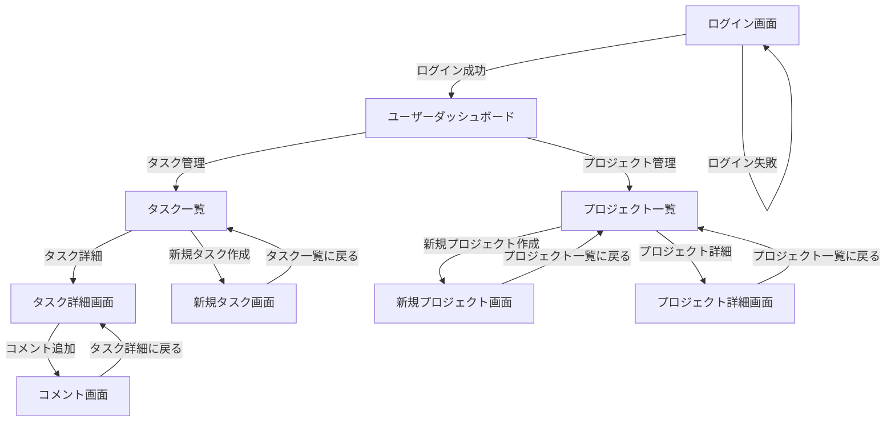

## 画面遷移図

画面遷移図は、ユーザーがシステム内でどのように画面を移動するかを示す図です。この図を用いることで、ユーザーインターフェースの設計やユーザー体験を視覚的に理解しやすくなります。

### 画面遷移の説明

1. **ログイン画面**
   - ユーザーがシステムにアクセスするために必要な情報（ユーザーIDとパスワード）を入力します。
   - **遷移先**:
     - ログイン成功 → ユーザーダッシュボード
     - ログイン失敗 → エラーメッセージ表示

2. **ユーザーダッシュボード**
   - ユーザーが自身のタスクやプロジェクトを確認できるメイン画面です。
   - **遷移先**:
     - プロジェクト一覧 → プロジェクト詳細画面
     - タスク一覧 → タスク詳細画面
     - タスク作成画面
     - コメント機能

3. **プロジェクト一覧画面**
   - ユーザーが参加しているプロジェクトのリストを表示します。
   - **遷移先**:
     - プロジェクト詳細画面
     - プロジェクト作成画面

4. **プロジェクト詳細画面**
   - 選択したプロジェクトの詳細情報を表示します。
   - **遷移先**:
     - タスク一覧画面
     - ユーザー追加画面

5. **タスク一覧画面**
   - 選択したプロジェクトに関連するタスクのリストを表示します。
   - **遷移先**:
     - タスク詳細画面
     - タスク作成画面

6. **タスク詳細画面**
   - 選択したタスクの詳細情報を表示します。
   - **遷移先**:
     - コメント機能
     - タスク更新画面

7. **タスク作成画面**
   - 新しいタスクを作成するためのフォームが表示されます。
   - **遷移先**:
     - タスク一覧画面（作成後）

8. **コメント機能**
   - タスクに対するコメントを追加するためのインターフェースが表示されます。
   - **遷移先**:
     - タスク詳細画面

この画面遷移図により、ユーザーはシステム内でどのようにナビゲートし、各画面がどのように関連しているかを把握することができます。

## 7. サイトマップ

タスク管理システムのサイトマップは、ユーザーの役割（管理者、クライアント、一般ユーザー）に応じたページ構成を示します。

### サイトマップ（Mermaid形式）

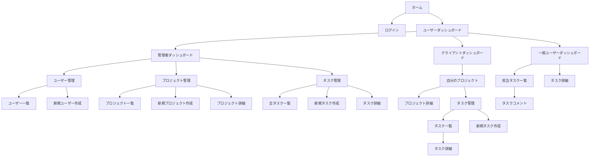

### 全ユーザー共通

- **ログイン画面**
  - ユーザーがシステムにログインするためのページ。

### 一般ユーザー

- **ユーザーダッシュボード**
  - ユーザーのプロジェクトやタスクの概要を表示するメインページ。
- **プロジェクト一覧**
  - ユーザーが参加しているすべてのプロジェクトを表示。
- **プロジェクト詳細画面**
  - 選択したプロジェクトの詳細情報を表示。
- **タスク一覧**
  - プロジェクトに関連するタスクのリストを表示。
- **タスク詳細画面**
  - 選択したタスクの詳細情報を表示。
- **コメント機能**
  - タスクに対するコメントを表示・追加するためのインターフェース。
- **タスク作成画面**
  - 新しいタスクを作成するためのフォームが表示。

### クライアント

- **クライアントダッシュボード**
  - クライアントが管理するプロジェクトやタスクの概要を表示。
- **プロジェクト管理**
  - プロジェクトの作成、編集、ユーザーの追加。
- **タスク管理**
  - プロジェクトに関連するタスクの管理。

### 管理者

- **管理者ダッシュボード**
  - システム全体の監視と管理を行うページ。
- **ユーザー管理**
  - ユーザーの追加、編集、削除を行うための管理ページ。
- **全プロジェクトの管理**
  - すべてのプロジェクトの状況を確認し、管理するためのページ。

### 各ページの説明

1. **ログイン画面**
   - ユーザーがシステムにログインするためのページ。
2. **ユーザーダッシュボード**
   - 一般ユーザーのプロジェクトやタスクの概要を表示するメインページ。
3. **クライアントダッシュボード**
   - クライアントの管理するプロジェクトやタスクを表示するページ。
4. **管理者ダッシュボード**
   - システム全体の監視と管理を行うページ。
5. **プロジェクト一覧**
   - 一般ユーザーが参加しているプロジェクトを表示。
6. **プロジェクト詳細画面**
   - 選択したプロジェクトの詳細情報を表示。
7. **タスク一覧**
   - プロジェクトに関連するタスクのリストを表示。
8. **タスク詳細画面**
   - 選択したタスクの詳細情報を表示。
9. **コメント機能**
   - タスクに対するコメントを表示・追加するためのインターフェース。
10. **タスク作成画面**
    - 新しいタスクを作成するためのフォーム。
11. **ユーザー管理**
    - ユーザーの追加、編集、削除を行うための管理ページ。
12. **プロジェクト管理**
    - クライアントによるプロジェクトの作成、編集、ユーザーの追加。

このサイトマップは、各ユーザーの役割に応じた機能とページを示しており、システム全体のナビゲーションを理解するのに役立ちます。